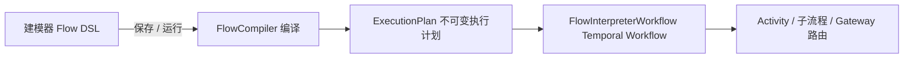
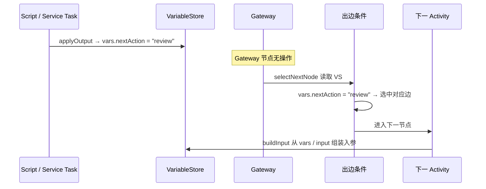

# FlowFoundry 变量使用与维护设计

本文档说明 FlowFoundry 在 workflow **执行前 → 执行中 → 节点间路由** 全流程里，task 参数与 gateway 中间变量如何传递、读写与维护。

实现级背景（Compiler、Interpreter、节点类型、Temporal 映射）见 [detailed-design.md](./detailed-design.md)。流程开发与联调见 [workflow-development-guide.md](./workflow-development-guide.md)。

---

## 1. 设计目标

FlowFoundry 采用 **通用解释器 + 编译执行计划** 的模式，而不是为每个流程生成专用 Workflow 代码。变量系统是这一模式的核心：

- **Workflow 内**维护统一的运行时状态（`VariableStore`），保证 Temporal replay 确定性。
- **Activity 层**只接收映射后的结构化 input，返回 result；不直接读写 Workflow 内存。
- **Gateway** 不单独持参，只读取已有变量做路由。
- **编译期**将 FEEL 条件解析为 Safe FEEL AST；**运行期**只求值 AST，不重新解析字符串。

---

## 2. 整体架构



| 阶段 | 载体 | 职责 |
|------|------|------|
| 设计时 | 画布 JSON（`FlowDefinition` / `FlowNode`） | 节点配置 `inputMapping`、`outputMapping`；边配置 `condition` |
| 编译时 | `FlowCompiler` | 校验图结构；FEEL → AST；生成 `ExecutionPlan` |
| 运行时 | `FlowInterpreterWorkflowImpl` | 维护 `VariableStore`；按节点类型执行；按边条件选下一跳 |

关键代码位置：

| 组件 | 路径 |
|------|------|
| 变量存储 | `flowfoundry-core/.../interpreter/runtime/VariableStore.java` |
| 入出参映射 | `flowfoundry-core/.../interpreter/runtime/MappingEvaluator.java` |
| 条件求值 | `flowfoundry-core/.../interpreter/runtime/ConditionEvaluator.java` |
| 解释执行 | `flowfoundry-core/.../interpreter/FlowInterpreterWorkflowImpl.java` |
| 编译 | `flowfoundry-core/.../flow/FlowCompiler.java` |
| 启动 API | `flowfoundry-core/.../api/FlowController.java` |

---

## 3. 变量模型：`VariableStore`

运行时所有可读状态集中在 `VariableStore`。Workflow 启动时用 API 传入的 `input` 初始化：

```java
// FlowInterpreterWorkflowImpl.run(...)
this.variables = new VariableStore(input);
```

### 3.1 三个命名空间

| 命名空间 | 表达式前缀 | 是否可写 | 含义 |
|----------|------------|----------|------|
| 启动入参 | `$.input.*` | **否** | `POST /api/flows/run` 请求体中的 `input` JSON |
| 流程变量 | `$.vars.*` | **是** | 执行过程中累积、节点间传递的业务状态 |
| 上次结果 | `$.lastResult` / `$.lastResult.*` | 自动更新 | 上一个 Activity（或人工任务完成）的返回值 |

此外：

- `$.` 或 `$`：返回 `{ input, vars, lastResult }` 的快照。
- 简写：表达式不带前缀时，先查 `vars` 顶层 key，再查 `input` 顶层 key；若路径含 `.` 或 `[`，会按路径在 `vars` / `input` 中逐段解析，最后回退到 `lastResult`。
- 嵌套对象：支持 `$.vars.customer.name`、`$.input.customer.address.city`。
- 数组下标：支持 `$.vars.contacts[0].phone`、`$.input.items[-1].sku`（见 §3.4）。
- 复杂类型：`lastResult` 为 Record 或 JavaBean 时，支持按字段名读取；JSON 数组反序列化为 `List`，可按整数下标访问（含 Python 风格负下标）。

### 3.2 写入规则

- 仅 **`$.vars.*`**（或简写目标名）可通过 `VariableStore.assign()` 写入。
- 尝试写入 `$.input.*` 或 `$.lastResult` 会抛出 `IllegalArgumentException`。
- 写入时若中间路径不存在，会自动创建嵌套 `Map`；遇到 `[index]` 时会创建或扩展 `List`，不足下标时用 `null` 占位后再写入。
- 支持写入数组元素及其子字段，例如 `$.vars.contacts[0].phone` 或 `order.items[1].sku`。

### 3.3 表达式语法

支持 `${...}` 包裹，与裸表达式等价：

```text
${$.input.campaignId}
$.vars.roundNumber
$.vars.contacts[0].phone
$.vars.contacts[-1].phone   // 最后一个元素
contacts[0].phone          // 简写，按路径解析 vars / input
```

### 3.4 嵌套对象与数组

FlowFoundry 变量值来自 JSON，因此天然支持 **嵌套对象** 与 **数组** 两种复合类型。

#### 嵌套 JSON 对象

启动 `input`、运行中 `vars`、Activity 返回的 `lastResult` 都可以是嵌套结构：

```json
{
  "customer": {
    "id": "c-1",
    "address": { "city": "北京" }
  }
}
```

路径用 **点号** 逐层访问：

```text
$.input.customer.address.city     → "北京"
$.vars.order.meta.status          → 写入 vars 后的嵌套字段
```

整对象也可以作为 mapping 的值传递，无需拆成标量：

```json
"inputMapping": {
  "customer": "$.input.customer",
  "payload": "$.vars.decisionResult"
}
```

#### 数组与下标

JSON 数组在运行时对应 `List`（如 `ArrayList`）。除整包传递外，支持 **`property[index]`** 形式访问元素：

```json
{
  "contacts": [
    { "name": "张三", "phone": "13800000001" },
    { "name": "李四", "phone": "13800000002" }
  ]
}
```

| 表达式 | 结果 |
|--------|------|
| `$.input.contacts[0].phone` | `"13800000001"` |
| `$.input.contacts[-1].phone` | 最后一个元素的 `phone` |
| `$.vars.items[1].sku` | 第二个元素的 `sku` |
| `$.lastResult.results[0].score` | Activity 返回数组中首项字段 |

**语法规则：**

- 下标为整数：`[0]`、`[1]`、`[-1]`（最后一个，类似 Python）。
- 负下标语义：`[-1]` = 最后一个，`[-2]` = 倒数第二个，即 `size + index`。
- 可与点路径组合：`contacts[0].phone`、`contacts[-1].phone`、`order.items[0].qty`。
- **读取**：下标越界（含负下标超出长度）返回 `null`。
- **写入**：非负下标会自动扩展 List；**负下标不能扩展空列表或越界**，与 Python 一致，越界抛 `Array index out of bounds`。
- 写入 `contacts[0].phone` 时，若 `contacts[0]` 不存在，会自动创建嵌套 `Map` 再写入 `phone`。
- Java 原生数组（`Object[]`）只读支持下标访问（含负下标）；Workflow 变量写入侧统一使用 `List`。

**Gateway 条件示例：**

```text
vars.contacts[-1].phone = "13800000001"
vars.contacts[0].qty > 0
```

编译后变量引用为 `vars.contacts[0].phone`，运行时经 `VariableStore.resolve("$.vars.contacts[0].phone")` 求值。

#### 类型能力对照

| 能力 | 嵌套对象 | 数组 `List` |
|------|----------|-------------|
| 作为 `input` / `vars` / `lastResult` 的值 | ✅ | ✅ |
| 点路径 `a.b.c` | ✅ | — |
| 下标路径 `a[0].b` / `a[-1].b` | ✅（中间节点为 List） | ✅ |
| `inputMapping` 整包传递 | ✅ | ✅ |
| `outputMapping` 写入整包或元素 | ✅ | ✅ |
| Gateway FEEL 读标量 | ✅ | ✅（需写下标） |
| 部分更新某一数组元素 | ✅ | ✅ |

---

## 4. 执行主循环

```text
while currentNodeId != null:
  node = plan.requireNode(currentNodeId)
  executeNode(node)           // 按节点类型执行，可能更新 vars / lastResult
  if node is END: break
  currentNodeId = selectNextNode(node)   // 读 VariableStore，评估出边条件
```

各节点类型对变量的影响：

| 节点类型 | 是否改变量 | 说明 |
|----------|------------|------|
| `START` | 否（已在 `run()` 初始化） | 流程入口 |
| `END` | 否 | 结束 |
| `GATEWAY` | 否 | 仅路由；条件在出边上求值 |
| `ACTIVITY` / `HUMAN_TASK` | 是 | Activity 返回 → `applyOutput` |
| `INTERMEDIATE_EVENT` | 读（仅 Timer `value`/`timezone`） | Timer 等待；**不写** vars；`value` 可引用 `${...}`，见 [timer-design.md](./timer-design.md) |
| `CHILD_WORKFLOW` | 是 | 子流程 input 来自 mapping（默认仅父 `vars`）；`InterpreterState` 经 outputMapping 回写 — 见 [child-workflow-design.md](./child-workflow-design.md) |

---

## 5. Activity 入参：`inputMapping` 与 `inputArgs`

### 5.1 `inputMapping` 语义

节点 DSL / `ExecutionNode` 上的 `inputMapping` 为 `Map<String, String>`：

- **key**：Activity 收到的参数名（target）。
- **value**：从 `VariableStore` 解析的源表达式（source）。

示例：

```json
{
  "inputMapping": {
    "campaignId": "$.input.campaignId",
    "roundNumber": "$.vars.roundNumber",
    "maxRounds": "$.input.maxRounds"
  }
}
```

### 5.2 `inputMappingMode`

| 模式 | wire 值 | 行为 |
|------|---------|------|
| 透传未映射字段（默认） | `passthrough-unmapped` | 显式 mapping 的字段 + `input` 中其余字段一并传给 Activity |
| 仅映射字段 | `mapped-only` | 只传 `inputMapping` 中列出的字段 |

- 未配置任何 `inputMapping` 时：**整个 `input` JSON 原样透传**给 Activity（与模式无关）。
- 模式在节点 `inputMappingMode` 字段配置，编译时写入 `ExecutionNode.config.inputMappingMode`。

### 5.3 `inputArgs`（位置参数）

`inputArgs` 为表达式列表，解析后放入 Activity input 的 `_args` 字段（单元素 List 包裹数组），供需要 positional 参数的 Activity 使用。

### 5.4 实际发给 Activity 的完整 input

除 mapping 结果外，`routerInput()` 还会附加系统字段：

| 字段 | 含义 |
|------|------|
| `_executionContext` | `runSource`、`businessKey`、`workflowId`（stub / 真实 Activity 切换） |
| `_config` | 节点 `config`（如 humanTask 模式、decisionRef、`taskHeaders`） |
| `_args` | `inputArgs` 解析结果（若有） |
| `_flowFoundryTrace` | 节点追踪信息（日志、Temporal UI summary） |

#### Task Headers（`config.taskHeaders`）

原画布独立字段 `node.headers` 已合并进 **`config.taskHeaders`**：

- 建模器 **Task Headers** 面板写入 `config.taskHeaders`（JSON 对象）。
- 加载旧模型时，遗留的 `node.headers` 自动迁移到 `config.taskHeaders` 并删除顶层字段。
- 编译后进入 `ExecutionNode.config`，运行时经 `_config.taskHeaders` 传给 Activity。
- Activity 读取：`TaskHeaders.fromActivityInput(input)`（Java 工具类）。
- **不是**流程变量，不参与 Gateway；用于静态路由提示、租户、优先级等。

```json
{
  "taskHeaders": {
    "x-tenant": "demo",
    "x-priority": "high"
  }
}
```

Activity 经 `CompositeDynamicActivityRouter` 按 `activityType` 路由；业务实现通常只关心 mapping 出来的业务字段。

---

## 6. Activity 出参：`outputMapping` 与 `lastResult`

每次 Activity 执行后：

1. **`lastResult` 总是更新**为 Activity 返回值（无论是否配置 outputMapping）。
2. 若配置了 **`outputMapping`**，按映射把值写入 **`vars`**。

```json
{
  "outputMapping": {
    "remainingContacts": "$.lastResult.remainingContacts",
    "roundNumber": "$.lastResult.nextRoundNumber",
    "nextAction": "$.vars.nextAction"
  }
}
```

- **key**：写入目标，通常为 `$.vars.xxx` 或简写 `xxx`（写入 vars）。
- **value**：源表达式，多数从 `$.lastResult.*` 取值。

未配置 `outputMapping` 时：仅更新 `lastResult`；后续边条件仍可通过 `$.lastResult.*` 引用，但不会自动进入 `vars`。

---

## 7. Gateway 与边条件

### 7.1 Gateway 不做参数传递

`GATEWAY` 节点在 `executeNode()` 中**无执行逻辑**；路由发生在 `selectNextNode()`：

```text
遍历当前节点所有出边（按 ExecutionPlan 顺序）:
  若边条件求值为 true → 走该边
  否则记录 default 边
若无匹配 → 走 default 边（若有）
```

Gateway 使用的「中间参数」就是 **`VariableStore` 中已有的 `input` / `vars` / `lastResult`**，无需 Gateway 单独配置 mapping。

当前支持的网关类型：`exclusive`（排他）。`parallel` / `inclusive` / `eventBased` 尚未实现。

### 7.2 边条件（Safe FEEL）

**设计时**：建模器 Sequence Flow 上配置 FEEL 表达式或 `default`。

**编译时**（`SafeFeelCompiler`）：FEEL 字符串 → Safe FEEL AST，写入 `ExecutionEdge.condition`：

```json
{
  "target": "supervisorReview",
  "condition": {
    "language": "safe-feel-ast",
    "display": "nextAction = \"review\"",
    "ast": {
      "op": "=",
      "left": { "var": "vars.nextAction" },
      "right": "review"
    }
  }
}
```

**运行时**（`ConditionEvaluator`）：只对 AST 求值，支持 `and` / `or` / `not`、比较运算、变量引用（`input.*` / `vars.*` / `lastResult.*`）。

`default` 边：条件为空或为 `"default"` 时标记为默认边；仅当没有其他边匹配时选中。

### 7.3 典型 Gateway 数据流



**复杂分支推荐模式**：Script Task（`script-runtime`）执行复杂规则，结果写入 `vars`；Gateway 边上只做简单 FEEL 比较（如 `nextAction = "review"`）。

---

## 8. 特殊节点类型的变量行为

### 8.1 子流程（CHILD_WORKFLOW）

完整运行语义、编译内嵌与 v1 限制见 **[child-workflow-design.md](./child-workflow-design.md)**。

```text
childInput = buildInput(父 VariableStore, 节点 inputMapping, inputMappingMode)
若 childInput 为空 → 使用父流程 vars（不含 $.input）
启动子 FlowInterpreterWorkflow.run(childExecutionPlan, childBusinessKey, childInput, ...)
父流程 applyOutput(子 InterpreterState, outputMapping)
```

- 子流程拥有**独立** `VariableStore`；其 `input` = 父流程 mapping 结果。
- 子流程的 `vars` 与父流程隔离；仅通过 `outputMapping` 显式回写。
- 子 `run()` 返回 **`InterpreterState`**；`outputMapping` 的 source 从该对象解析字段。

### 8.2 人工任务（HUMAN_TASK）

两阶段写变量：

1. **Activity 阶段**：`HumanTaskActivity` 注册系统内待办上下文 → 第一次 `applyOutput`。
2. **Signal 阶段**：`POST /api/flows/runs/{workflowId}/human-task` → 第二次 `applyOutput` → 写入 `humanTask.{nodeId}.outcome`。

Human Task 统一语义：调用 Activity 后 Workflow 暂停，等待 `completeHumanTask` Signal。旧 DSL 中的 `mode = offline` 在加载与运行时归一化为 `managed`。

### 8.3 Timer（INTERMEDIATE_EVENT）

Timer 节点 **不向 `vars` 写入**；进入节点时从当前 `VariableStore` **读取** `timerDefinition.value` / `timezone`（支持 `${slot.fixedTime}` 等），计算等待时长后调用 Temporal Timer。

- **`type=duration`**：`value` 解析为相对时长（如 `5m`、`${waitMs}`）
- **`type=date`**：`value` + `timezone` 解析为绝对时刻；目标已过时由 `pastTargetStrategy` 决定立即继续或失败

完整语义见 [timer-design.md](./timer-design.md)。长时间等待应使用 Timer，而非 Activity 内 sleep。

---

## 9. 端到端示例

### 9.1 启动

```json
POST /api/flows/run
{
  "flow": { "...": "FlowDefinition" },
  "businessKey": "order-1001",
  "input": {
    "campaignId": "cmp-001",
    "maxRounds": 3
  }
}
```

初始状态：

| 路径 | 值 |
|------|-----|
| `$.input.campaignId` | `"cmp-001"` |
| `$.input.maxRounds` | `3` |
| `$.vars.*` | （空） |
| `$.lastResult` | `null` |

### 9.2 Script Task

节点配置：

```json
{
  "activityType": "script-runtime",
  "decisionRef": "campaign-next-action",
  "inputMapping": {
    "remainingContacts": "$.vars.remainingContacts",
    "roundNumber": "$.vars.roundNumber",
    "maxRounds": "$.input.maxRounds"
  },
  "outputMapping": {
    "nextAction": "$.vars.nextAction",
    "needReview": "$.vars.needReview"
  }
}
```

Activity 返回 `{ "nextAction": "review", "needReview": true }` 后：

| 路径 | 值 |
|------|-----|
| `$.vars.nextAction` | `"review"` |
| `$.vars.needReview` | `true` |
| `$.lastResult` | Activity 完整返回值 |

### 9.3 Gateway 出边

```json
[
  { "target": "supervisorReview", "condition": "nextAction = \"review\"" },
  { "target": "continueDial", "condition": "default" }
]
```

解释器读取 `vars.nextAction`，选中 `supervisorReview`。

### 9.4 下一 Activity

```json
{
  "inputMapping": {
    "campaignId": "$.input.campaignId",
    "needReview": "$.vars.needReview"
  }
}
```

---

## 10. 建模器配置入口

在建模器节点属性面板中：

| 配置项 | 字段 | 说明 |
|--------|------|------|
| 输入映射 | `inputMapping` | JSON 对象，target → source 表达式 |
| 未配置字段策略 | `inputMappingMode` | `passthrough-unmapped` / `mapped-only` |
| 输出映射 | `outputMapping` | JSON 对象，vars 目标 → 源表达式 |
| Task Headers | `config.taskHeaders` | 静态元数据 JSON，运行时 `_config.taskHeaders` |
| 边条件 | `edge.condition` | FEEL 或 `default` |

未配置 `inputMapping` 时，面板提示：执行输入 JSON 的全部字段会透传给 Activity。

---

## 11. 维护与排查指南

### 11.1 查询运行时变量

`GET /api/flows/runs/{workflowId}` 返回的 `InterpreterState` 包含：

- `variables`：当前 `vars` 快照
- `lastResult`：最近一次 Activity / 人工任务结果

注意：`input` 不在 `InterpreterState` 中单独暴露；需要通过 Workflow query 或日志侧确认启动参数。

### 11.2 常见问题

| 现象 | 可能原因 | 建议 |
|------|----------|------|
| Activity 收不到某字段 | `mapped-only` 且未写入 mapping | 改为 `passthrough-unmapped` 或补全 mapping |
| Gateway 总走 default | 条件引用 vars 但 outputMapping 未写入 | 检查 Script Task 的 outputMapping |
| 条件永远 false | 变量路径错误（写了 `input.x` 实际应在 `vars`） | 统一使用 `$.vars.*` / `$.input.*` 前缀 |
| 数组字段读不到 | 用了 `contacts.0.phone` 而非 `contacts[0].phone` | 数组下标必须用 `[index]` 语法 |
| 数组下标越界读为 null | 索引超出 List 长度 | 写入时会自动扩展；读取越界返回 `null` |
| 子流程 vars 丢失 | 子流程独立作用域 | 在子流程节点配置 outputMapping 回写父流程 |
| replay 非确定性 | 条件依赖外部状态 | 复杂逻辑放 Activity；边上只用 Safe FEEL AST |

### 11.3 变更与版本

- `ExecutionPlan` 随 Flow 编译生成，**已启动实例引用启动时的 plan**，不随画布后续修改自动变更。
- 修改变量 mapping 或边条件后，需重新编译并启动新实例验证。
- Safe FEEL evaluator 与 Execution Plan 版本绑定；条件语义变更需评估对运行中实例 replay 的影响。

### 11.4 命名约定建议

| 用途 | 建议 |
|------|------|
| 流程启动参数 | 放在 `input`，命名稳定、与业务实体对应 |
| 节点间传递 | 写入 `vars`，语义清晰（如 `roundNumber`、`nextAction`） |
| 仅本步使用 | 可只依赖 `lastResult`，或临时 vars 用后覆盖 |
| 人工任务结果 | `humanTask.{nodeId}.outcome` + outputMapping 到业务 vars |
| 子流程边界 | 显式 inputMapping / outputMapping，避免隐式依赖全量 vars |

---

## 12. 设计要点总结

1. **单一变量中心**：`VariableStore` 是 Workflow 内唯一可变状态；Gateway 只读不写。
2. **映射即契约**：`inputMapping` / `outputMapping` 声明节点与变量空间的接口；默认行为在无 mapping 时有明确定义。
3. **`lastResult` 是桥梁**：连接 Activity 返回值与 outputMapping、后续 FEEL 条件。
4. **编译与运行分离**：FEEL 编译为 AST；运行只求值，保证 Temporal 确定性。
5. **Activity 解耦**：Workflow 通过 `activityType` + 映射 Map 调用业务，不直接依赖业务类。

---

## 13. 相关文档

- [detailed-design.md](./detailed-design.md) — Compiler / Interpreter、Safe FEEL、Script Task、双模式 Activity
- [workflow-development-guide.md](./workflow-development-guide.md) — 流程开发与联调
- [local-development.md](./local-development.md) — 本地 redeploy 与建模器测试
